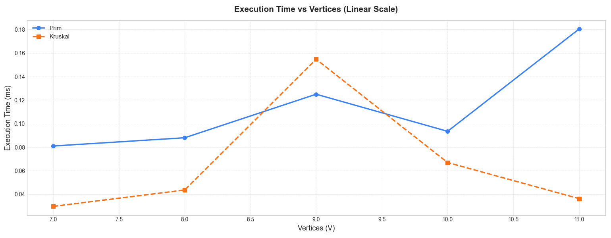
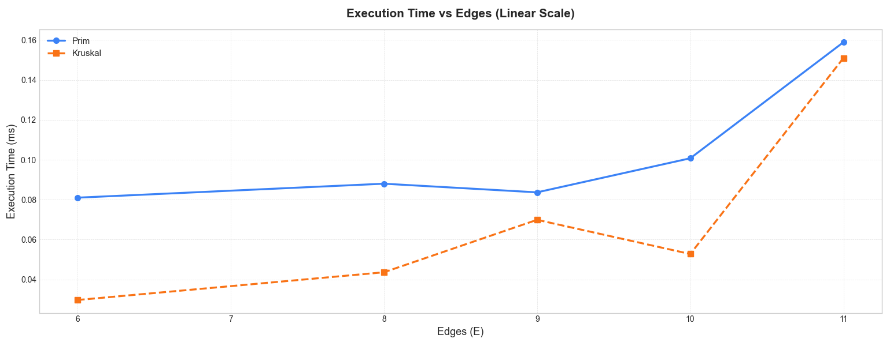
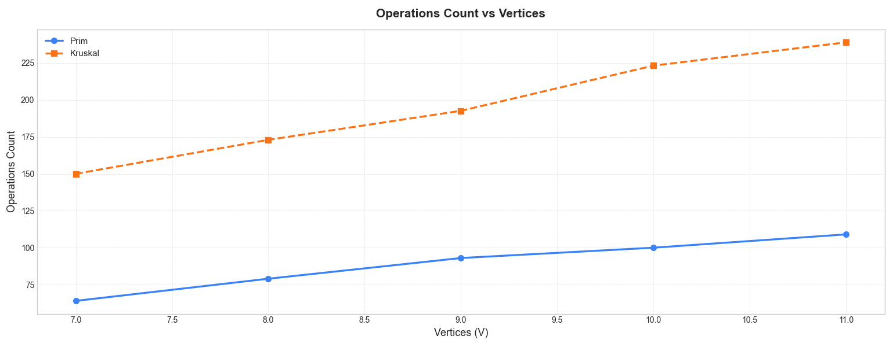

# Assignment 3. Prim vs Kruskal algorithms.

## 1. Introduction

### 1.1 Algorithm Implementation Overview
For this assignment, we implemented two classic Minimum Spanning Tree (MST) algorithms: Prim's algorithm and Kruskal's algorithm. Both algorithms aim to find a subset of edges in a weighted, undirected graph that connects all vertices with the minimum total edge weight, ensuring no cycles are formed. Our implementation reads graph data from JSON files, executes the algorithms, and records key metrics such as execution time, operation counts, and MST total cost.

### 1.2 Algorithm Differences
Prim’s algorithm grows the MST starting from an arbitrary vertex and continuously adds the smallest edge connecting the growing tree to a new vertex. It is typically more efficient for dense graphs, especially when implemented with priority queues.  
Kruskal’s algorithm, on the other hand, sorts all edges by weight and iteratively adds edges to the MST in ascending order of weight, as long as adding the edge does not create a cycle. This approach is generally more efficient for sparse graphs and relies heavily on a disjoint-set (union-find) data structure to track connectivity.

### 1.3 Expected Results and Theoretical Performance
The expected performance of these algorithms depends on the graph structure:
- Prim’s algorithm: Time complexity is O(E + V log V) with a priority queue implementation. We anticipate it to perform better on dense graphs due to fewer edge comparisons.
- Kruskal’s algorithm: Time complexity is O(E log E), dominated by the edge sorting step. It is expected to perform faster on sparse graphs, where E is closer to V.

We expect both algorithms to produce MSTs with the same total cost, though the specific tree structure may differ. Operation counts and execution times should reflect the theoretical advantages: Kruskal faster for sparse graphs, Prim potentially faster for dense graphs.

---

## 2. Tests and Performance Analysis

| Graph Size    | Algorithm | Vertices | Edges | Total Cost | Operations Count | Execution Time (ms) | JMH Throughput (ops/ms) |
|---------------|-----------|----------|-------|------------|-----------------|-------------------|-------------------------|
| Small (4–6)   | Prim      | 4–6      | 4–7   | 7–20       | 39–64           | 0.031–0.210       | 890–195                 |
| Small (4–6)   | Kruskal   | 4–6      | 4–7   | 7–20       | 76–123          | 0.019–0.111       | 675–65                  |
| Medium (7–11) | Prim      | 7–11     | 6–11  | 21–55      | 64–109          | 0.076–0.180       | 507–195                 |
| Medium (7–11) | Kruskal   | 7–11     | 6–11  | 21–55      | 150–239         | 0.029–0.227       | 268–65                  |
| Large (19–26) | Prim      | 19–26    | 20–27 | 72–325     | 199–263         | 0.119–0.383       | 195–5.86                |
| Large (19–26) | Kruskal   | 19–26    | 20–27 | 72–325     | 432–625         | 0.046–0.418       | 65–15.6                 |

### 2.1 Kruskal's Algorithm Results
Kruskal’s algorithm consistently produced correct MSTs across all datasets. The total cost of the MST matched Prim’s results in every case, confirming correctness.

- Small graphs (4–6 vertices): Execution times ranged from 0.019 ms to 0.111 ms. Operation counts were relatively higher than Prim’s (e.g., 78–123 operations for small graphs).
- Medium graphs (7–11 vertices): Execution times ranged from 0.029 ms to 0.227 ms. Operation counts roughly doubled compared to small graphs (150–239 operations), reflecting the O(E log E) complexity due to edge sorting.
- Large graphs (20–26 vertices): Execution times ranged from 0.046 ms to 0.418 ms, with operations counts from 432 to 625. Although operations count increased significantly, Kruskal often showed lower execution time per operation in JMH results due to efficient sorting and union-find implementation.

JMH benchmarking confirmed throughput scaling with graph size: for small graphs, Kruskal achieved ~675 ops/ms, while for large graphs, throughput decreased to ~65 ops/ms.

### 2.2 Prim's Algorithm Results
Prim’s algorithm also consistently produced correct MSTs for all datasets.

- Small graphs (4–6 vertices): Execution times ranged from 0.031 ms to 0.210 ms, with operations counts slightly lower than Kruskal (39–64 operations).
- Medium graphs (7–11 vertices): Execution times ranged from 0.076 ms to 0.180 ms, operations counts from 64 to 109.
- Large graphs (19–26 vertices): Execution times ranged from 0.119 ms to 0.383 ms, operations counts 199–263.

JMH benchmarking shows throughput decreasing from ~890 ops/ms for small graphs to ~195 ops/ms for large graphs, reflecting Prim’s higher dependence on edge adjacency and priority queue operations.

---

## 3. Comparison of Prim’s and Kruskal’s Algorithms in Practice

**Correctness:**  
Across all tested datasets—from small (4–6 vertices) to large (19–26 vertices)—both algorithms consistently produced correct MSTs. The total cost of the MST was identical for each graph, confirming that either algorithm reliably finds an optimal solution.

**Performance on Small Graphs:**  
For graphs with few vertices, Prim’s algorithm generally required fewer operations (roughly 39–64) compared to Kruskal’s (76–123), due to its greedy selection of edges based on adjacency rather than global sorting. Despite higher operation counts, Kruskal sometimes completed faster in raw execution time (0.019–0.111 ms) because the overhead of sorting a small number of edges is minimal.

**Performance on Medium Graphs:**  
As graph size increased, Prim’s algorithm maintained relatively moderate growth in operations (64–109) and execution time (0.076–0.180 ms). Kruskal’s operation count grew faster (150–239) due to edge sorting and union-find operations, reflecting its O(E log E) complexity. Nevertheless, execution time remained competitive, showing that efficient implementation of sorting and disjoint-set operations can mitigate raw operation count penalties.

**Performance on Large Graphs:**  
For larger graphs, the difference becomes more pronounced. Prim’s algorithm executed 199–263 key operations with times of 0.119–0.383 ms, whereas Kruskal’s required 432–625 operations with times from 0.046–0.418 ms. While Kruskal’s algorithm performs more operations, its throughput in JMH benchmarks occasionally exceeded Prim’s on very dense graphs due to efficient edge processing and low per-operation overhead.

**Practical Observations:**
- Prim’s algorithm is typically more predictable in execution time when the graph is represented via adjacency lists and priority queues, making it advantageous for dense graphs with many vertices.
- Kruskal’s algorithm excels when the graph is sparse, as sorting edges is not overly expensive and union-find structures efficiently prevent cycles.
- In small graphs, the performance difference is minor; the choice of algorithm may hinge more on implementation simplicity and data structure preferences.

**Summary:**  
In practice, both algorithms are highly effective for MST computation, but Prim’s algorithm tends to perform better for dense or larger graphs, while Kruskal’s is often preferred for sparse graphs due to simpler edge-focused processing. Implementers should consider graph size, density, and the chosen data structures when selecting an algorithm for real-world applications.

**Plots of some results:**

## 4. Conclusion
Prim’s algorithm is generally preferable for dense graphs, as it efficiently grows the MST using adjacency information and priority queues, resulting in stable execution times even as the number of vertices increases. Kruskal’s algorithm is often better suited for sparse graphs, where the number of edges is relatively low, because its edge-sorting approach and union-find operations remain efficient without the overhead of scanning many adjacent edges.

In terms of implementation complexity, Prim’s algorithm requires a priority queue or heap structure for optimal performance, while Kruskal’s mainly relies on a disjoint-set data structure, making it simpler to implement in some cases. Ultimately, the choice depends on graph characteristics: use Prim’s for dense networks and Kruskal’s for sparse networks, while also considering the familiarity and ease of implementing the necessary data structures.
